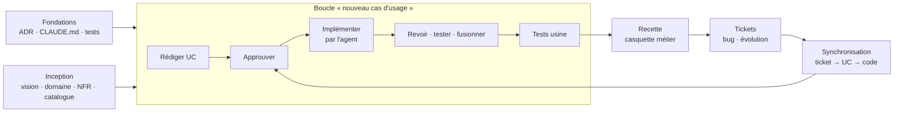

# Le workflow spec-driven de Vita

Ce document décrit **comment on travaille** sur ce dépôt : les artefacts, les rôles (trois casquettes portées par une seule personne), les deux flux — nouveau cas d'usage et synchronisation — et les points de passage obligés. Il est la référence que le [cadrage du POC](poc/cadrage-poc.md) éprouve. Les conventions de nommage et de traçabilité sont dans [conventions.md](conventions.md) ; le protocole pratique de séparation des casquettes est dans [poc/protocole-casquettes.md](poc/protocole-casquettes.md).

## 1. Principe

Le **cas d'usage** (UC) est l'artefact central. Il est écrit et approuvé **avant** toute implémentation, il est la seule source de vérité fonctionnelle pendant l'implémentation, et il est mis à jour **avant** le code quand un ticket le remet en cause. Le code est une conséquence du UC, jamais l'inverse.

Autour du UC, trois familles d'artefacts stables : l'**inception** (vision, modèle de domaine et glossaire, exigences non fonctionnelles) qui donne le cadre commun à tous les UC ; les **fondations** (ADR, règles pour l'agent, stratégie de tests) qui cadrent la manière de construire ; et les **tickets** qui font vivre l'ensemble après livraison.

## 2. Les trois casquettes

| Casquette | Responsabilité | Artefacts qu'elle produit | Ce qu'elle ne fait jamais |
|---|---|---|---|
| **Analyste** | Comprendre le besoin, l'écrire sans ambiguïté, l'approuver ; faire les tests usine sur la livraison | UC, mises à jour du modèle de domaine et des NFR, tickets « retour » clos | Lire le code pour décider du contenu de la spec ; approuver un UC qui ne passe pas la check-list |
| **Développeur** | Piloter l'agent de code à partir du UC approuvé, relire les diffs, garantir tests et fondations, fusionner | Code, tests, PR, section « Réalisation » du UC, ADR | Modifier le contenu fonctionnel d'un UC ; implémenter un UC non approuvé |
| **Métier** | Utiliser l'application, juger si elle rend le service attendu, signaler | Tickets bug et évolution | Toucher aux specs ou au code |

Dans Vita, une seule personne porte les trois. Le [protocole de séparation](poc/protocole-casquettes.md) fixe comment on change de casquette sans que les rôles se contaminent.

## 3. Flux « nouveau cas d'usage »

| Étape | Casquette | Ce qui est fait | Artefact et trace |
|---|---|---|---|
| 3.1 Sélection | Analyste | Prendre le prochain UC du [catalogue](../specs/use-cases/catalogue.md) selon la priorité ; vérifier ses dépendances | Statut `identifié` → `en rédaction` ; branche `spec/UC-###` |
| 3.2 Rédaction | Analyste | Rédiger le UC à partir du [template](../specs/use-cases/_template-uc.md), en n'utilisant que le vocabulaire du [glossaire](../specs/domain/modele-domaine.md) ; si une notion ou une règle de domaine manque, l'ajouter au modèle de domaine dans la même branche | Fichier `UC-###-nom.md` ; commits `spec(UC-###): …` |
| 3.3 Approbation | Analyste | Passer la **check-list « prêt à implémenter »** (§5). Tout point non satisfait renvoie en rédaction. | Statut `prêt`, date d'approbation dans le UC, commit `spec(UC-###): approuve v1.0`, fusion de la branche `spec/` dans `main` |
| 3.4 Implémentation | Développeur | Dans une **nouvelle session**, lancer l'agent sur le UC approuvé (commande `/implementer-uc UC-###`). L'agent lit le UC, le domaine, les NFR, les ADR et `CLAUDE.md`, propose un plan, puis implémente et écrit les tests `T-###-##`. Le développeur relit chaque diff. | Statut `en implémentation` ; branche `uc/UC-###-nom` ; commits `feat(UC-###): …` |
| 3.5 Retour analyste | Développeur | Si le UC est silencieux ou contradictoire sur un point **fonctionnel**, l'agent ne devine pas : il ouvre un ticket « retour analyste » et l'implémentation s'arrête sur ce point. Les choix purement techniques sont couverts par les ADR et `CLAUDE.md` ; s'ils ne le sont pas, le développeur note une décision technique dans la section « Réalisation » ou ouvre un ADR. | Ticket `retour-analyste`, lié au UC ; traité par l'analyste (mise à jour du UC, nouvelle version, réapprobation) |
| 3.6 Revue et tests | Développeur | PR ouverte avec le template ; CI verte (lint, types, tests unitaires et composants, audit axe, e2e) ; revue manuelle clavier et lecteur d'écran ; captures 360 / 768 / 1280 px ; **contrôle d'écart** spec ↔ livraison (chaque étape, extension, règle, message et test du UC est pointé) | PR référençant `UC-###` ; section « Réalisation » du UC remplie (PR, écarts, décisions techniques) |
| 3.7 Fusion | Développeur | Fusion dans `main` quand la **définition de « fini »** (§6) est satisfaite | Statut `livré` ; journal du POC complété |
| 3.8 Tests usine | Analyste | Dérouler les tests d'acceptation du UC sur l'application construite depuis `main`, à la main, avec le regard de l'auteur de la spec | Résultat noté dans le journal ; écarts → tickets bug |

## 4. Flux « synchronisation »

Un ticket ne conduit **jamais** directement à une modification du code. Il conduit d'abord à une décision sur le UC.

| Étape | Casquette | Ce qui est fait | Artefact et trace |
|---|---|---|---|
| 4.1 Création | Métier | Ouvrir un ticket avec le template bug ou évolution, en désignant le UC concerné (ou « je ne sais pas ») | Issue GitHub, label `type:bug` ou `type:evolution`, label `UC-###` |
| 4.2 Qualification | Analyste | Lire le ticket face au UC. Trois issues possibles : **le UC est respecté et le comportement est voulu** (ticket fermé avec explication) ; **le code ne respecte pas le UC** (bug de réalisation : le UC ne change pas) ; **le UC doit changer** (bug de spécification ou évolution). | Commentaire de qualification sur le ticket ; label `sync:code-seul` ou `sync:spec-et-code` |
| 4.3 Mise à jour de la spec | Analyste | Si le UC change : statut `à synchroniser`, nouvelle version du UC (scénario, règles, messages, tests mis à jour ; ligne d'historique avec le numéro du ticket), passage de la check-list, réapprobation | Branche `spec/UC-###-ticket-NN` ; commit `spec(UC-###): v1.1 — #NN …` ; statut `prêt` |
| 4.4 Mise à jour du code | Développeur | Nouvelle session ; commande `/synchroniser NN`. L'agent lit le ticket, la version courante du UC et le diff de spec, puis met le code et les tests en conformité. Pour un bug de réalisation (`sync:code-seul`), il part du UC inchangé et du ticket. | Branche `ticket/NN-…` ; commits `fix(UC-###): #NN …` ou `feat(UC-###): #NN …` |
| 4.5 Revue, fusion, clôture | Développeur puis métier | PR liée au ticket et au UC ; mêmes exigences qu'en 3.6 et 3.7 ; le métier vérifie sur `main` et ferme le ticket | PR « Closes #NN » ; statut `livré` ; journal |

## 5. Check-list « prêt à implémenter » (approbation d'un UC)

Un UC passe à `prêt` seulement si **tous** les points sont satisfaits. L'analyste coche la liste dans le message du commit d'approbation ou dans la PR de spec.

1. Le résumé dit en trois phrases ce que l'utilisateur obtient et pourquoi.
2. L'acteur, le déclencheur, les préconditions et les postconditions sont explicites.
3. Le scénario nominal est numéroté, chaque étape alterne clairement action de l'utilisateur et réponse du système, et il se termine sur un état observable.
4. Chaque cas d'erreur, alternative ou interruption plausible a une extension, avec son point de retour dans le scénario.
5. Toutes les données manipulées sont décrites : nom du glossaire, type, obligatoire ou non, contraintes, valeur par défaut, message en cas d'erreur.
6. Les règles sont identifiées (`RG-###-##`), formulées de manière testable, et les règles de domaine applicables sont référencées (`RG-D##`).
7. L'interface est décrite structurellement pour chaque écran : zones, ordre de lecture, action principale, états vide / chargement / erreur, comportement à 360 px, points d'accessibilité spécifiques.
8. **Tous** les textes visibles sont dans la section Messages (`MSG-###-##`) : libellés, aides, erreurs, confirmations, états vides. Aucun texte n'est laissé à l'invention de l'agent.
9. Les tests d'acceptation (`T-###-##`) couvrent le scénario nominal et chaque extension, en « Étant donné / Quand / Alors », avec des données fictives précises.
10. Les objectifs produit (`O-##`) et les NFR (`NFR-##`) applicables sont référencés ; les NFR spécifiques éventuelles sont écrites.
11. Le vocabulaire est celui du glossaire ; toute nouvelle notion ou règle a été ajoutée au modèle de domaine.
12. Il ne reste aucune question ouverte bloquante ; celles qui restent sont explicitement hors périmètre.
13. Le UC ne décrit pas la solution technique (pas de nom de composant, de table, d'API) — sauf contrainte assumée et justifiée.

## 6. Définition de « fini » (fusion d'une PR)

1. Chaque test d'acceptation `T-###-##` du UC a un test automatisé portant son identifiant, et il passe.
2. Lint, vérification de types, tests unitaires et de composants, audit d'accessibilité automatisé et tests de bout en bout sont verts en CI.
3. La revue manuelle a été faite : navigation clavier complète, lecture au lecteur d'écran de chaque écran livré, scénario d'interruption de saisie si le UC saisit des données.
4. Les captures à 360, 768 et 1280 px sont jointes à la PR.
5. Le contrôle d'écart est fait : chaque étape, extension, règle et message du UC est pointé vers son implémentation, et tout écart est soit corrigé, soit documenté dans la section « Réalisation » avec un ticket.
6. Aucune règle des fondations n'est violée ; aucune dépendance hors liste autorisée sans justification ; aucune donnée réelle, aucun secret.
7. La section « Réalisation » du UC est remplie (PR, date, écarts, décisions techniques), le catalogue et le statut sont à jour, le journal du POC est complété.

## 7. Versions et statuts d'un UC

Un UC porte une **version** (`0.x` en rédaction, `1.0` à la première approbation, `1.1`, `1.2`… à chaque réapprobation après ticket) et un **statut** : `identifié` → `en rédaction` → `prêt` → `en implémentation` → `livré` → (`à synchroniser` → `prêt` → …). Le statut vit dans l'en-tête du UC et dans le catalogue, tenus à jour dans le même commit. Le script `scripts/check-specs.mjs`, exécuté en CI, vérifie la cohérence des identifiants, des statuts et des liens.

## 8. Ce que l'agent de code a le droit de faire

L'agent travaille sous les règles de [`CLAUDE.md`](../CLAUDE.md). Il implémente, teste, documente sa réalisation et propose des décisions techniques ; il ne modifie ni le contenu fonctionnel d'un UC, ni le modèle de domaine, ni les NFR, ni un ADR accepté. Quand il manque une information fonctionnelle, il **s'arrête et demande** via un ticket « retour analyste » plutôt que d'interpréter : c'est la règle qui permet de mesurer la qualité des specs (hypothèse H1 du POC).
