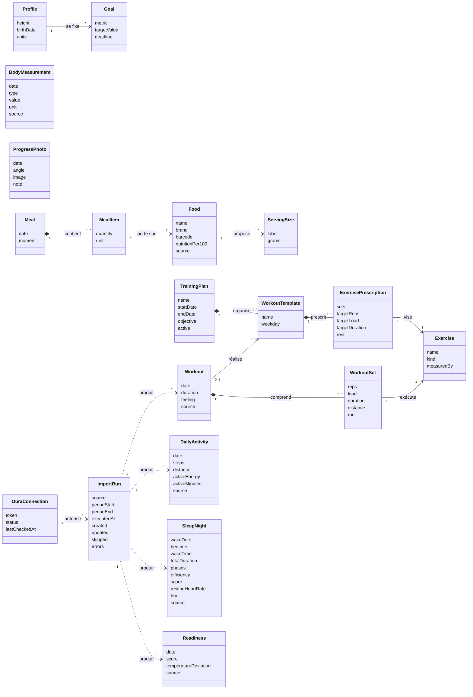

# Modèle de domaine et glossaire — Vita

| | |
|---|---|
| **Statut** | v1.0 — validé le 11 septembre 2026 ; modèle initial d'inception, affiné au fil des UC |
| **Date** | 11 septembre 2026 |
| **Documents liés** | [Vision](../vision.md) · [Catalogue des UC](../use-cases/catalogue.md) · [NFR](../nfr.md) |

Ce document fixe le **vocabulaire** commun aux specs, au code et aux tickets, et le **modèle conceptuel** des données. Il est volontairement conceptuel : il décrit les notions et leurs relations, pas les tables ni les structures techniques, qui relèvent de l'architecture (ADR-001). Chaque terme du glossaire est le terme à utiliser dans les UC ; en code, la traduction anglaise indiquée est obligatoire.

## 1. Glossaire

| Terme (FR) | En code | Définition | Domaine |
|---|---|---|---|
| **Profil** | `Profile` | Mes caractéristiques stables : taille, date de naissance, unités préférées. Un seul profil. | Profil et objectifs |
| **Objectif** | `Goal` | Une cible que je me fixe sur une grandeur suivie (poids cible, pas par jour, heures de sommeil, apport calorique), avec une échéance optionnelle. | Profil et objectifs |
| **Mesure corporelle** | `BodyMeasurement` | Une valeur mesurée sur mon corps à une date : poids, tour de taille, de hanches, de poitrine, de bras, de cuisse, pourcentage de masse grasse. Une mesure = une grandeur, une valeur, une unité, une date, une source. | Évolution physique |
| **Grandeur** | `MeasurementType` | Le type d'une mesure corporelle (poids, tour de taille, …), avec son unité par défaut. | Évolution physique |
| **Photo d'évolution** | `ProgressPhoto` | Une photo de moi prise à une date sous un angle donné (face, profil, dos), stockée localement, avec une note optionnelle. | Évolution physique |
| **Aliment** | `Food` | Un produit ou une préparation que je peux consommer, avec ses valeurs nutritionnelles pour 100 g (ou 100 ml) et éventuellement des portions usuelles. Créé à la main ou importé d'Open Food Facts. | Repas |
| **Valeurs nutritionnelles** | `NutritionFacts` | Énergie (kcal), protéines, glucides, lipides, et optionnellement fibres, sucres, sel, pour une quantité de référence. | Repas |
| **Portion usuelle** | `ServingSize` | Une quantité nommée d'un aliment (« 1 tranche », « 1 bol »), exprimée en grammes ou millilitres, pour accélérer la saisie. | Repas |
| **Repas** | `Meal` | Un ensemble de prises alimentaires à une date et un moment de la journée (petit-déjeuner, déjeuner, dîner, collation). | Repas |
| **Prise** | `MealItem` | Une ligne d'un repas : un aliment et une quantité. Les apports de la prise sont calculés à partir de l'aliment. | Repas |
| **Apports** | `Intake` | Les valeurs nutritionnelles totales d'une prise, d'un repas ou d'une journée, calculées et jamais saisies. | Repas |
| **Exercice** | `Exercise` | Un mouvement ou une activité nommée (développé couché, course, gainage), avec son type (force, cardio, mobilité) et la façon dont on le mesure (séries × répétitions × charge, ou durée et distance). | Entraînement |
| **Plan d'entraînement** | `TrainingPlan` | Une période (dates de début et de fin) avec un objectif et un ensemble de séances modèles réparties dans la semaine. Un seul plan actif à la fois. | Entraînement |
| **Séance modèle** | `WorkoutTemplate` | Une séance type d'un plan : un nom, un jour de semaine, une liste de prescriptions. | Entraînement |
| **Prescription** | `ExercisePrescription` | Ce qui est prévu pour un exercice dans une séance modèle : nombre de séries, répétitions ou durée cibles, charge cible, repos. | Entraînement |
| **Séance réalisée** | `Workout` | Une séance effectivement faite à une date, rattachée ou non à une séance modèle, avec ses séries réalisées, une durée, un ressenti et une source (saisie ou montre). | Entraînement |
| **Série réalisée** | `WorkoutSet` | Une série effectuée d'un exercice dans une séance réalisée : répétitions, charge, durée ou distance, effort perçu. | Entraînement |
| **Journée d'activité** | `DailyActivity` | Le résumé d'activité d'une date : pas, distance, énergie active, minutes d'activité, score d'activité, avec sa source. | Objets connectés |
| **Nuit de sommeil** | `SleepNight` | Le sommeil rattaché à une date de réveil : heures de coucher et de lever, durée totale, durées par phase (léger, profond, paradoxal, éveil), efficacité, score, fréquence cardiaque au repos et variabilité (HRV), avec sa source. | Objets connectés |
| **Récupération** | `Readiness` | L'indicateur de récupération d'une date (score de readiness Oura, température, variabilité), avec sa source. | Objets connectés |
| **Source** | `DataSource` | L'origine d'une donnée : saisie manuelle, Oura, Apple Santé, Open Food Facts. Toute donnée en porte une. | Transverse |
| **Connexion Oura** | `OuraConnection` | Le jeton d'accès personnel à l'API Oura et l'état de la connexion (valide, expirée, absente). Stocké localement, jamais dans le dépôt. | Objets connectés |
| **Import** | `ImportRun` | Une exécution d'import depuis une source, avec sa période, sa date d'exécution, son résultat (nombre d'enregistrements créés, mis à jour, ignorés) et ses erreurs. Rejouable sans doublon. | Objets connectés |
| **Tableau de bord** | `Dashboard` | La vue de synthèse d'une date (jour) ou d'une période (semaine), calculée à partir des autres notions ; ne stocke rien. | Tableau de bord |
| **Export** | `DataExport` | Une copie complète et lisible de toutes mes données, produite à la demande. | Données |

## 2. Modèle conceptuel

Le tableau de bord et l'export n'apparaissent pas dans le diagramme : ce sont des vues calculées à partir des notions ci-dessus, sans état propre.

## 3. Règles de domaine transverses

Ces règles valent pour tous les cas d'usage ; un UC peut les préciser mais pas les contredire. Elles sont identifiées pour être référencées depuis les UC (`RG-D##`).

| ID | Règle |
|---|---|
| **RG-D01** | Toute donnée porte une **source**. Une donnée importée n'est jamais modifiable à la main ; si elle est fausse, c'est à la source qu'on la corrige, puis on réimporte. Une donnée saisie manuellement est toujours modifiable et supprimable. |
| **RG-D02** | Une **date** de donnée est une date civile locale (jour), sans heure, sauf quand l'heure fait partie de la mesure (coucher, lever, début de séance). Une nuit de sommeil est rattachée à sa **date de réveil**. |
| **RG-D03** | Les **apports** d'un repas ou d'une journée sont toujours calculés à partir des aliments et des quantités, jamais saisis ni stockés comme valeur de référence. |
| **RG-D04** | Un **import est idempotent** : le rejouer sur la même période ne crée pas de doublon, il met à jour ce qui a changé et ignore le reste. La clé d'unicité est (source, notion, date). |
| **RG-D05** | Quand deux sources fournissent la même notion pour la même date (par exemple les pas d'Oura et d'Apple Santé), on conserve les deux enregistrements ; le tableau de bord applique une **source de préférence** par notion, définie dans le profil, et l'indique. |
| **RG-D06** | Les **unités** sont métriques (kg, cm, km, kcal) et stockées telles quelles ; l'affichage suit les unités du profil. |
| **RG-D07** | Il n'y a qu'un **plan d'entraînement actif** à la fois ; activer un plan désactive le précédent sans le supprimer. |
| **RG-D08** | Aucune notion ne porte d'interprétation médicale : pas de seuils « normal / anormal », pas de recommandation. Les objectifs sont les seules cibles, et ce sont les miennes. |
| **RG-D09** | Une **suppression** d'une donnée manuelle est immédiate mais annulable pendant un court délai (pattern « annuler » plutôt que confirmation préalable), sauf pour un plan d'entraînement ou un aliment utilisé par des repas, qui demandent confirmation parce que la suppression a des conséquences en cascade. |

## 4. Évolution de ce modèle

Ce modèle est un point de départ. Chaque cas d'usage peut ajouter un attribut, une notion ou une règle ; la modification se fait **dans ce document** (jamais uniquement dans le UC), avec mention du UC qui l'a motivée, pour que le vocabulaire reste unique. Le journal du POC note chaque fois qu'un UC a fait évoluer le modèle : c'est une des mesures de la maturité de l'inception.
